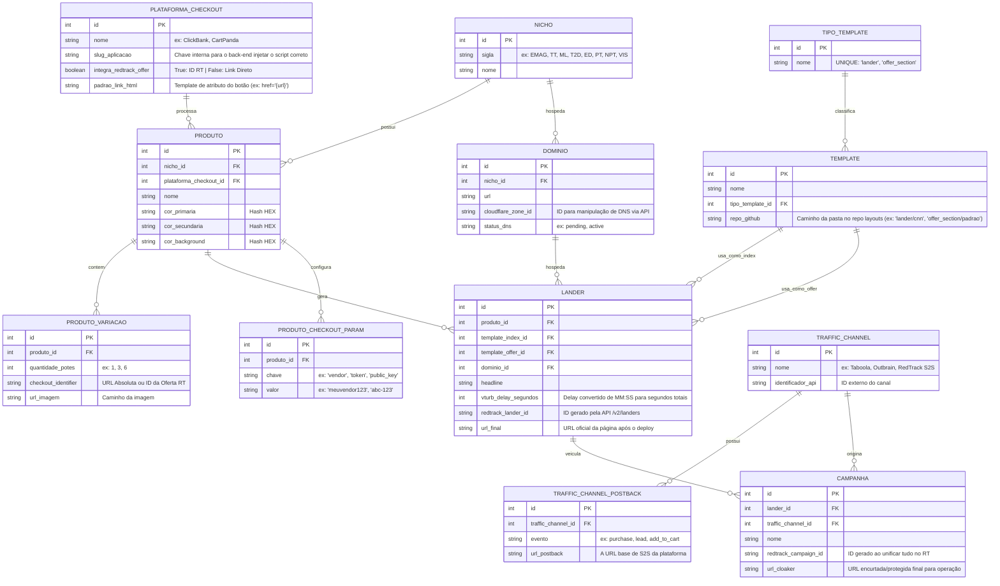

# Documentação Técnica: Modelagem de Banco de Dados (Landers & Campanhas)

Esta documentação descreve o modelo relacional desenvolvido para o ecossistema de automação de marketing de afiliados. A arquitetura foi desenhada na Terceira Forma Normal (3FN), garantindo que o sistema seja agnóstico em relação a nichos, plataformas de checkout e canais de tráfego, além de manter a responsabilidade de injeção de scripts estritamente na camada da aplicação (back-end).

---

## 1. Diagrama Entidade-Relacionamento (DER)

Abaixo está o diagrama unificado representando as entidades principais, seus atributos e a cardinalidade dos relacionamentos.

---

## 2. Dicionário de Dados

### 2.1. Núcleo de Produtos e Checkout
Estas tabelas definem o que está sendo vendido e como a transação será processada técnica e visualmente.

| Tabela | Coluna | Tipo | Restrição | Descrição |
| :--- | :--- | :--- | :--- | :--- |
| **Plataforma_Checkout** | `slug_aplicacao` | VARCHAR(50) | UNIQUE, NOT NULL | Chave de identificação única (ex: `clickbank`) lida pelo back-end para localizar scripts no repositório da aplicação. |
| **Plataforma_Checkout** | `integra_redtrack_offer` | BOOLEAN | NOT NULL | Se `TRUE`, o link final usa o ID da oferta do RedTrack (Listicle = True). Se `FALSE`, usa o link de checkout direto (Listicle = False). |
| **Plataforma_Checkout** | `padrao_link_html` | VARCHAR(255) | NOT NULL | Padrão string (ex: `href="{url}"` ou `href="#" data-click-path="/click/{qtd}"`) usado pela automação para injetar os atributos nos botões. |
| **Nicho** | `sigla` | VARCHAR(10) | UNIQUE, NOT NULL | Identificador curto do nicho (ex: WL, MM). Facilita o mapeamento de domínios e repositórios. |
| **Produto** | `plataforma_checkout_id` | INT | FK, NOT NULL | Relaciona o produto à sua engine de pagamento. |
| **Produto** | `cor_primaria`, `_secundaria`, `_background` | VARCHAR(7) | NOT NULL | Hashes HEX injetados como variáveis CSS globais (`:root`) no template de oferta. |
| **Produto_Checkout_Param** | `chave` / `valor` | VARCHAR | NOT NULL | Estrutura EAV (Entity-Attribute-Value). Armazena credenciais dinâmicas do produto (ex: `vendor` do Clickbank) sem engessar a tabela Produto. |
| **Produto_Variacao** | `quantidade_potes` | INT | NOT NULL | Mapeia dinamicamente os pacotes disponíveis (1, 3, 6 potes). Resolve a cardinalidade N do produto. |
| **Produto_Variacao** | `checkout_identifier` | VARCHAR(500) | NOT NULL | Armazena a URL absoluta final ou o ID interno da oferta no RedTrack. |
| **Produto_Variacao** | `url_imagem` | VARCHAR(500) | NOT NULL | Caminho da imagem específica da variação para injeção no template. |

### 2.2. Infraestrutura e Front-end (Deploy)
Responsáveis pelo gerenciamento de arquivos físicos e URLs.

| Tabela | Coluna | Tipo | Restrição | Descrição |
| :--- | :--- | :--- | :--- | :--- |
| **Tipo_Template** | `nome` | VARCHAR(100) | UNIQUE, NOT NULL | Nome do tipo (`'lander'` ou `'offer_section'`). Reflete exatamente os prefixos de pasta no repo `layouts`. |
| **Template** | `tipo_template_id` | INT | FK, NOT NULL | Liga o template ao seu tipo. Substitui o antigo campo enum `tipo`. Usado para filtrar templates na UI do operador. |
| **Template** | `repo_github` | VARCHAR(500) | NOT NULL | Caminho da **pasta** do template dentro do repositório `layouts`. Formato: `'lander/cnn'` ou `'offer_section/padrao'`. O sistema lê recursivamente todos os arquivos dessa pasta. |
| **Dominio** | `cloudflare_zone_id` | VARCHAR(100) | NOT NULL | Necessário para automação e manipulação de registros DNS via API do Cloudflare. |
| **Lander** | `vturb_delay_segundos` | INT | NOT NULL | Armazena o cálculo matemático em segundos totais (convertidos de MM:SS pelo payload de entrada) para injetar no delay. |
| **Lander** | `redtrack_lander_id` | VARCHAR(100) | NULLABLE | Armazena o ID primário gerado no RedTrack após a chamada na API `/v2/landers`. |

### 2.3. Tráfego e Campanhas
Gerenciamento sólido e isolado das fontes de tráfego e consolidação final do link operacional.

| Tabela | Coluna | Tipo | Restrição | Descrição |
| :--- | :--- | :--- | :--- | :--- |
| **Traffic_Channel** | `nome` | VARCHAR(100) | UNIQUE, NOT NULL | Entidade isolada validada previamente pela função autônoma do back-end (`getOrCreateTrafficChannel`). |
| **Traffic_Channel_Postback**| `evento` | VARCHAR(50) | NOT NULL | Define a conversão (ex: `purchase`, `lead`). |
| **Traffic_Channel_Postback**| `url_postback` | VARCHAR(500) | NOT NULL | A base do link S2S que será unida à campanha no RedTrack. |
| **Campanha** | `url_cloaker` | VARCHAR(500) | NULLABLE | A URL final, com todos os tokens devidamente amarrados, gerada para ser inserida pelo operador na plataforma de anúncio. |

---

## 3. Decisões Estratégicas de Arquitetura

1. **Remoção de Scripts do Banco de Dados:**
   A tabela `PLATAFORMA_CHECKOUT` delega a responsabilidade do código JavaScript para o back-end através da coluna `slug_aplicacao`. Isso eleva o nível de segurança (prevenindo *Cross-Site Scripting* armazenado), facilita as revisões de código via GitHub (PRs) e tira o peso de blocos de texto do banco relacional. O back-end lê o slug, busca o arquivo local correspondente (ex: `clickbank-tracker.js`) e injeta no placeholder final.
2. **Abstração Dinâmica de Botões (`padrao_link_html`):**
   Garante que os arquivos HTML estáticos permaneçam completamente "limpos". O banco de dados armazena o formato do link exigido pela plataforma de checkout (com chaves para `url` ou `qtd`). O compilador back-end monta a *string* e insere nas variáveis `{{attr_botao_X_potes}}`.
3. **Escalabilidade com EAV (`Produto_Checkout_Param`):**
   Se uma nova plataforma (ex: Stripe) for adotada e exigir três chaves criptográficas diferentes, nenhuma alteração de schema (como `ALTER TABLE`) será necessária. Os parâmetros são inseridos verticalmente (Chave-Valor) atrelados ao `produto_id`.
4. **Resolução de Variações na 1FN (`Produto_Variacao`):**
   A criação de uma tabela filha para suportar a quantidade de potes (1, 2, 3, 5, 6...) previne a existência de colunas fixas vazias na tabela raiz de produto e permite loops contínuos no motor de injeção da automação.
5. **Repositório Único de Templates (`layouts`):**
   Todos os templates front-end residem em um único repositório `layouts`, organizado em duas pastas raízes: `lander/` e `offer_section/`. Cada sub-pasta é um template completo (HTML + CSS + JS + assets). O campo `Template.repo_github` armazena o caminho da **pasta** (ex: `'lander/cnn'`), não de um arquivo individual. O sistema lê todos os arquivos da pasta recursivamente via API do GitHub.
6. **Deploy via SSH com Git Nativo:**
   O deploy de páginas para os repositórios de destino (um por nicho) é feito via Git SSH usando uma chave privada ED25519 (`deploy_bot`). O sistema clona o repositório localmente, escreve os arquivos compilados, faz `git commit` e `git push`. Isso elimina as limitações da API REST do GitHub (tamanho de arquivo, latência, atomicidade) e garante commits únicos por deploy.
7. **Estrutura de Destídino no Repo de Páginas:**
   Cada lander ocupa uma pasta isolada (`lander-{id}/`) no repositório do nicho. Os assets do `index` ficam na raiz da pasta; os assets da `offer` ficam numa sub-pasta `offer/`. O arquivo `offer.html` é renomeado para `offer/index.html` automaticamente pelo compilador.